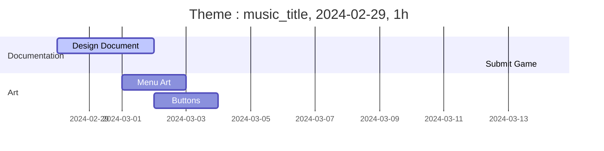

# Game Design Document: Disturbance Within
## Introduction
### Game Summary
"KAOS: Disturbance Within" is a platform-adventure game set after an apocolyptic event that killed most life, and introduced new lifeforms that don't play by the rules.
### Inspiration
#### Cave Story
Cave Story is a _2d platform-adventure metroidvania game_ where the player explores the cavernous interior of a floating island, _gaining weapons and leveling them up_ in a fight against an evil doctor.
#### Prey (2017)
In Prey, the player unlocks various abilities, some of which are _derived from the aliens attacking the station_, while trying to survive in a large space station.
### Player Experience
### Platform
The game will be released for Windows and the Web, with possible builds for Linux and MacOS (with limited testing).
### Development Software
__Art__: Aseprite  
__Engine__: Godot 4  
__Audio__: REAPER
### Genre
Singleplayer Platform-Adventure (Metroidvania) game with horror elements
### Target Audience
## Concept
### Gameplay Overview
The player controls a survivor in the game world, looking for shelter in the ruins of civilization. They are armed with a gun that recharges over time (special eldritch power), and must defeat enemies to accomplish goals. Upon defeating special bosses, they will assorb the ability the bos used during the fight.
### Theme Interpretation
__Theme__: Aberration
> A departure from what is normal, usual, or expected, typically one that is unwelcome.

Set in a world after some sort of eldricht apocolypse, the player and enemy bosses are aberrations, making use of otherworldly, unholy abilities. While fighting these bosses, various audio-visual aberrations will also occur, adding to the unsettling feeling.
### Primary Mechanics
### Secondary Mechanics
## Art
### Theme Interpretaion
### Design
## Audio
### Music
The soundtrack will make use of piano and orchestral sounds to represent the natural order of things, and synths, both waveform and sample based, to represent the aberrant. 
### Sound Effects
Like the music, effects interacting with the physical world will be more natural sounding, while boss abilities will sound more unnatural
## Game Experience
### UI
### Controls
The player will use keyboard and mouse, or a controller, to move around the level and fight.
Default Controls:
Keyboard: WASD move, space jump
Mouse: aim and shoot
Controller: Left stick move, right stick aim, left trigger jump, right trigger shoot
## Development Timeline

### Extra Tasks
